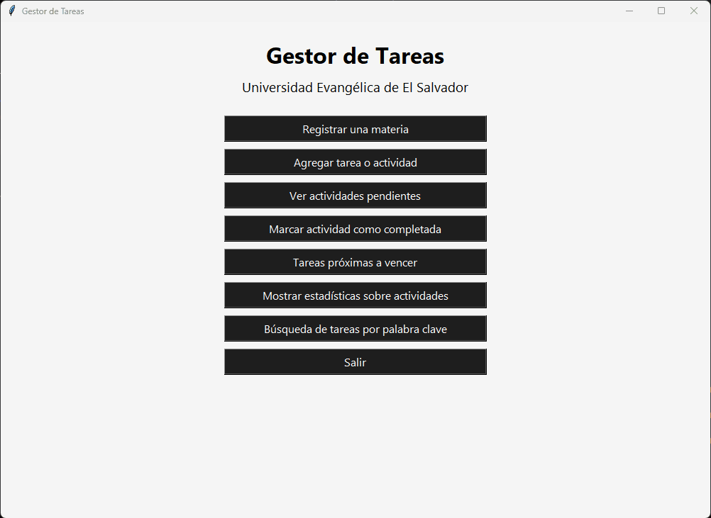

# Documentación

[](LICENSE)
[](https://github.com/ayorick23/project-task-manager/releases)

## Descripción del Proyecto

### Propósito

### Características

### Tecnologías usadas

## Capturas de Pantalla




## Instalación

### Requisitos Previos

- Python 3.12+
- Tkinter

### Pasos de instalación

1. Clona el repositorio

```bash
   git clone https://github.com/ayorick23/project-task-manager.git
```

2. Instala las dependencias

```bash
   pip install requirements.txt
```

3. Ejecuta el archivo `app.py`

## Estructura del repositorio

```plaintext
gestor_tareas/
│
├── src/                         #Código fuente principal
│ ├── models/                    #Clases y lógica de datos
│ │ ├── **init**.py
│ │ └── gestor_tareas.py         #Funciones principales
│ │
│ ├── controllers/               #Lógica de negocio
│ │ ├── **init**.py
│ │ └── gestor_tareas.py         #Funciones principales (agregar, completar, etc.)
│ │
│ ├── views/                     #Interfaces gráficas
│ │ ├── **init**.py
│ │ └── main_window.py           #Pantalla principal
│ │
│ └── app.py                     #Punto de entrada (main)
│
├── tests/                       #Pruebas unitarias
│ ├── **init**.py
│ └── test_gestor.py
│
├── requirements.txt             #Dependencias
└── README.md                    #Documentación
```

## Contribución

1. Haz fork del proyecto
2. Crea tu rama (`git checkout -b feature/nueva-funcionalidad`)
3. Haz commit de tus cambios (`git commit -m 'Agrega nueva funcionalidad'`)
4. Haz push a la rama (`git push origin feature/nueva-funcionalidad`)
5. Abre un Pull Request

## Futuras funcionalidades

- [ ] Función para editar y eliminar materias
- [ ] Función para editar y eliminar tareas
- [ ] Implementación de un login-logout-register
- [ ] Cambio de persistencia de datos de JSON a SQLServer

## Licencia

Por definir

## Contacto

Para preguntas, contacta a [@ayorick23](https://github.com/ayorick23) o abre un issue.
